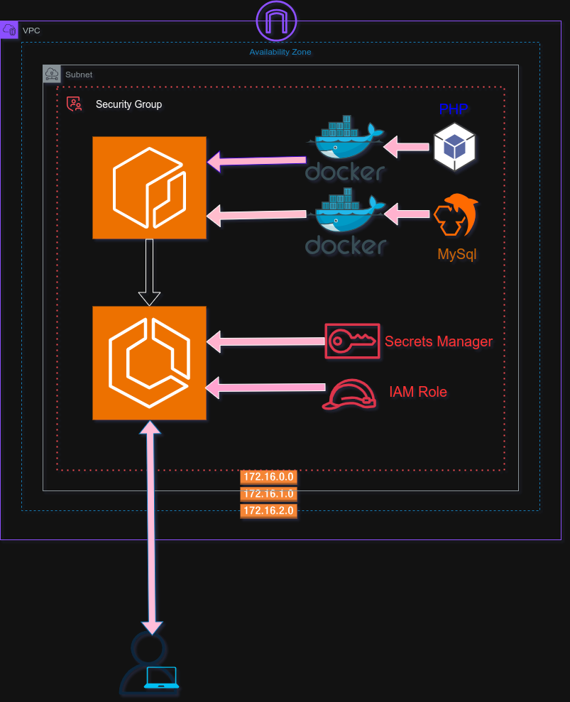

# Containerized LAMP Visit Counter on AWS ECS (Fargate)

# Link to my running app: http://63.33.190.168

This project deploys a lightweight, containerized LAMP (Linux, Apache, MySQL, PHP) stack application to AWS using **Amazon ECS with Fargate**. The application is a simple visit counter that increments on each page load.

---

## 📦 Project Structure

```

.
├── Dockerfile.app        # PHP + Apache container
├── Dockerfile.db         # MySQL container
├── index.php             # PHP visit counter logic
├── task-def.json         # ECS Task Definition
├── README.md             # This file

```

---

## 🧱 Technologies Used

- **Docker**: Containerize the application
- **Amazon ECR**: Store container images
- **Amazon ECS (Fargate)**: Host and manage containers
- **IAM Roles**: Grant task execution permissions
- **CloudWatch (Optional)**: View container logs

---



## 🔒 Security Configuration

### Database Credentials with AWS Secrets Manager

For enhanced security, database credentials are stored in AWS Secrets Manager instead of hardcoded values.

#### 1. Create Secret in AWS Secrets Manager

1. Go to **AWS Secrets Manager** in the console
2. Click **Store a new secret**
3. Select **Other type of secret**
4. Add key-value pairs:
   - `username`: `root`
   - `password`: `SecurePassword123!` (do well to change this to a more secure password)
   - `database`: `counter_db`
5. Name it: `lamp-mysql-credentials`
6. Click **Store**

#### 2. Configure IAM Role

Run the `task-iam-role` script to create the IAM role with Secrets Manager permissions:

```bash
bash task-iam-role
```

This creates:

- ECS Task Execution Role
- Secrets Manager access policy
- Proper trust relationships

#### 3. Environment Variables

The PHP application uses environment variables:

- `DB_USER`: Database username (default: root)
- `DB_PASS`: Retrieved from Secrets Manager
- `DB_NAME`: Database name (default: counter_db)

---

## 🚀 How to Deploy

### 1. 🔧 Prerequisites

- AWS CLI and Docker installed
- IAM user/role with ECS, ECR, and VPC permissions
- A VPC with public subnet, route table, internet gateway, and security group

### 2. 🐳 Build and Push Images to ECR

```bash
# Authenticate
aws ecr get-login-password --region eu-west-1 | docker login --username AWS --password-stdin <your_account_id>.dkr.ecr.eu-west-1.amazonaws.com

# Build and tag images
docker build -t lamp-app -f Dockerfile.app .
docker tag lamp-app <account_id>.dkr.ecr.eu-west-1.amazonaws.com/lamp-app

docker build -t lamp-db -f Dockerfile.db .
docker tag lamp-db <account_id>.dkr.ecr.eu-west-1.amazonaws.com/lamp-db

# Push to ECR
docker push <account_id>.dkr.ecr.eu-west-1.amazonaws.com/lamp-app
docker push <account_id>.dkr.ecr.eu-west-1.amazonaws.com/lamp-db
```

### 3. 📦 Register ECS Task Definition

```bash
aws ecs register-task-definition --cli-input-json file://task-def.json
```

Make sure the `task-def.json` file:

- Defines two containers: `app` and `mysql`
- Uses multiple connection methods: `localhost`, `mysql`, `127.0.0.1`
- Includes `executionRoleArn` and MySQL health check
- Sets proper container dependencies with `HEALTHY` condition

### 4. 📡 Create ECS Cluster and Service

- Go to the **ECS Console**
- Create a **Fargate Cluster**
- Create a **Service** with the task definition
- Assign a **public subnet**, security group with port **80** open
- Enable **auto-assign public IP**

### 5. 🌍 Access the App

Once deployed:

- Go to the **ECS Service > Tasks > Network**
- Copy the **Public IP**
- Open in browser: `http://<public-ip>`

You should see something like:

```
Visit Count: 5
```

---

## 🧠 Notes

- Both containers run in the same ECS task, sharing the same network namespace
- PHP app connects on: `127.0.0.1`
- MySQL health check ensures database is ready before app container starts
- Connection warnings are normal - app eventually connects successfully
- Visit counter uses proper database table with primary key for accurate incrementing

---

## 🧹 Cleanup

```bash
aws ecs delete-service --cluster lamp-cluster --service lamp-service --force
aws ecs deregister-task-definition --task-definition lamp-task
```

---
